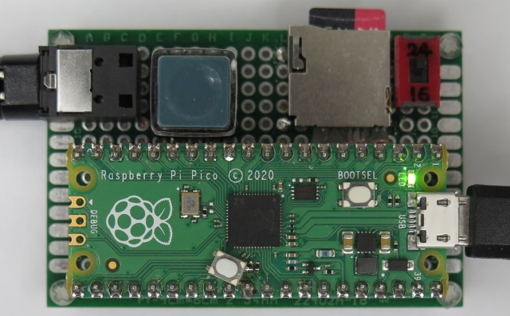
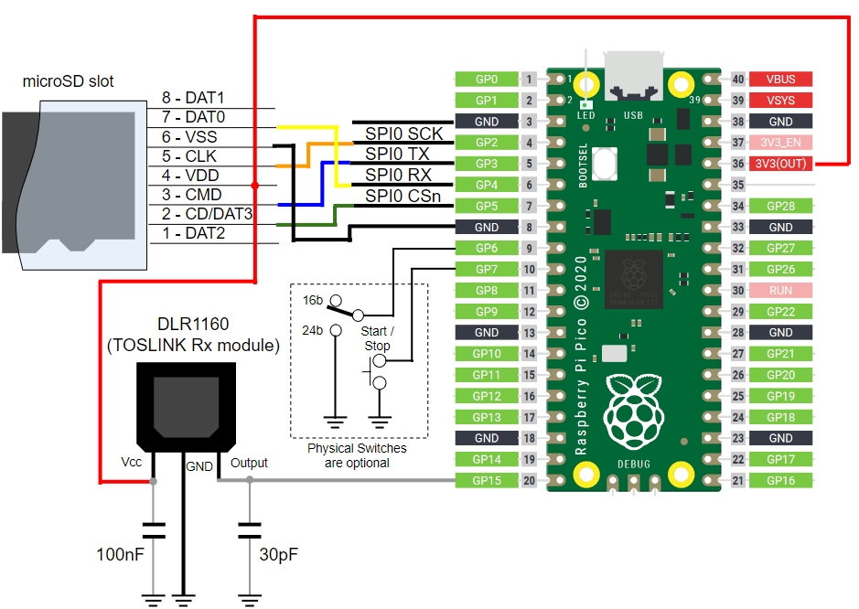
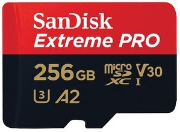

# Raspberry Pi Pico spdif_recorder



## Overview
* Hi-Res recorder from S/PDIF input to WAV files on microSD card
* Bit resolution: 16bit or 24bit (2ch)
* Sampling frequency: 44.1 KHz, 48.0 KHz, 88.2 KHz, 96.0 KHz (, 176.4 KHz, 192 KHz)
* Recording only, no monitoring or playback functions

## Supported Board and Peripheral Devices
* Raspberry Pi Pico or Raspberry Pi Pico W (rp2040)
* S/PDIF Coaxial or TOSLINK Rx module (DLR1160 or equivalent)
* microSD cards (recommend SD-XC, V30 cards)

## Pin Assignment & Connection



### S/PDIF Rx
| Pico Pin # | GPIO | Function | Connection |
----|----|----|----
| 20 | GP15 | DATA | from S/PDIF data |

### microSD card

| Pico Pin # | Pin Name | Function | microSD Pin Name | microSD Pin # |
----|----|----|----|----
|  4 | GP2 | SPI0_SCK | CLK | 5 |
|  5 | GP3 | SPI0_TX | CMD | 3 |
|  6 | GP4 | SPI0_RX | DAT0 | 7 |
|  7 | GP5 | SPI0_CSn | CD/DAT3 | 2 |
|  8 | GND | GND | VSS | 6 |
| 36 | 3V3(OUT) | 3.3V | VDD | 4 |

Note:
* As for the wire length between Pico and SD card, short wiring as possible is desired, otherwise errors such as Mount error and Write fail will occur.

### Button/Switch (Optional)
| Pico Pin # | GPIO | Function | Connection |
----|----|----|----
| 9 | GP6 | Input | 16bit/24bit switch |
| 10 | GP7 | Input | Start/Stop button |

## How to build
* See ["Getting started with Raspberry Pi Pico"](https://datasheets.raspberrypi.org/pico/getting-started-with-pico.pdf)
* Put "pico-sdk", "pico-examples" and "pico-extras" on the same level with this project folder.
* Set environmental variables for PICO_SDK_PATH, PICO_EXTRAS_PATH and PICO_EXAMPLES_PATH
* Build is confirmed in Developer Command Prompt for VS 2022 and Visual Studio Code on Windows enviroment
* Confirmed with Pico SDK 1.5.1, cmake-3.27.2-windows-x86_64 and gcc-arm-none-eabi-10.3-2021.10-win32
```
> git clone -b 1.5.1 https://github.com/raspberrypi/pico-sdk.git
> cd pico-sdk
> git submodule update -i
> cd ..
> git clone -b sdk-1.5.1 https://github.com/raspberrypi/pico-examples.git
>
> git clone -b sdk-1.5.1 https://github.com/raspberrypi/pico-extras.git
> 
> git clone -b main https://github.com/elehobica/pico_spdif_recorder.git
> cd pico_spdif_recorder
> git submodule update -i
> cd ..
```
* Lanuch "Developer Command Prompt for VS 2022"
```
> cd pico_spdif_recorder
> mkdir build && cd build
> cmake -G "NMake Makefiles" ..
> nmake
```
* Put "pico_spdif_recorder.uf2" on RPI-RP2 drive

## Serial command interface
* Serial interface is available from USB port of Raspberry Pi Pico.

| Key | Function |
----|----
| Space | Recording Start Standby / Recording Stop |
| r | Resolution change 16bit/24bit (default: 16bit) |
| s | Manual split |
| b | Auto blank split on/off (default: on) |
| v | Verbose for monitoring messages |
| c | Clear WAV file suffix to 1 |
| w | Configure Wi-Fi (for Raspberry Pi Pico W only) |
| h | Help |

### Recording start/stop/split features
* Standby recording start while silence and auto start when sound detected
* Auto stop and standby restart when long blank detected
* Auto split of WAV file when short blank detected
* Manual immediate split of WAV file without gap

### LED indicator
* Slow blink: Recording is on-going.
* Fast blink: Background file proceses to close previous file and prepare next file are on-going. During this term, no command requests can be accepted.
* Repeated Slow blink and Fast blink: indicating errors (see log on serial console.)

## microSD card
### Card recommendation for Hi-Res recording
* Due to the limitation of single bit SPI interface driven by Raspberry Pi Pico, even with highest class microSD cards (as of 2024), recording in 24bit 176.4 KHz or 192.0 KHz is challenging. It will sometimes causes the drops of audio sampling data. The bandwidth status can be monitored in Verbose mode.
* The most severe situation for bandwidth is to start suceeeding track recording when previous long-time track more than 20 minutes has to be closed.
* With following recommended microSD cards, recording in 24bit 96.0 KHz will be stable as far as experimentally confirmed.
* Format micorSD card in exFAT with [official SD Card Formatter](https://www.sdcard.org/downloads/formatter/) before usage. 

| # | Vendor | Product Name | Part Number | Comment |
----|----|----|----|----
| 1 | Samsung | PRO Plus 256GB | MB-MD256SA | 24bit/192KHz is worth trying for non-long-time tracks. 24bit/96KHz is stable. |
| 2 | SanDisk | Extreme PRO 256GB | SDSQXCD-256G-GN6MA | 24bit/192KHz is too challenging. 24bit/96KHz is stable. |

  

### File timestamp
* File timestamp is synchronized to NTP if using Raspberry Pi Pico W and connected to Wi-Fi.
* Otherwise, timestamp starts from 0:00 a.m. Jan. 1st, 2024 (UTC+0).
* exFAT format (thus, > 64GB SD-XC cards) is recommended to reflect timezone.
* In case of FAT32 format, timestamp cannot reflect timezone, therefore, it's always shown as UTC+0 time.

### Card trouble shooting
* In case of card mount error or fundamental access errors, please confirm with [FatFs test](lib/pico_fatfs_customized/test)
